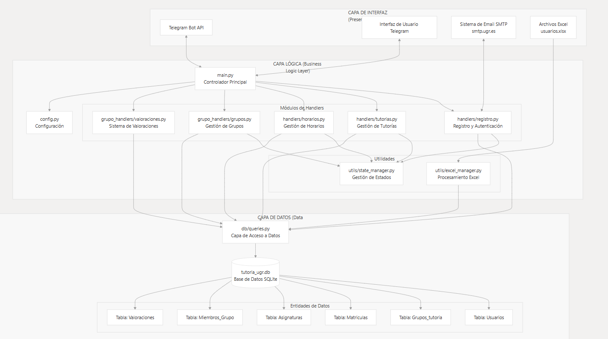

# 📚 Automatización de Tutorías Universitarias con Telegram Bot

[](https://www.python.org/) [](LICENSE)

## 🔍 Descripción breve

Este proyecto crea un sistema de gestión de tutorías universitarias basado en bots de Telegram, que automatiza el registro de usuarios, la reserva de citas y la creación de grupos privados, además de recopilar métricas de uso.

## 📑 Índice

1. [Características Clave](#características-clave)
2. [Arquitectura](#arquitectura)
3. [Instalación & Configuración](#instalación--configuración)
4. [Uso](#uso)
5. [Estructura del Repositorio](#estructura-del-repositorio)
6. [Resumen del TFG](#resumen-del-tfg)
7. [Roadmap / Futuras mejoras](#roadmap--futuras-mejoras)
8. [Contribuir](#contribuir)
9. [Licencia & Créditos](#licencia--créditos)

---

---

## Características Clave

* **Registro automatizado** de estudiantes y profesorado desde un fichero Excel.
* **Reservas de tutorías** con control de disponibilidad y notificaciones.
* **Creación de grupos privados** para cada sesión de tutoría.
* **Métricas en tiempo real**: tiempos de respuesta, ratios de asistencia y valoraciones.
* **Arquitectura modular** en tres capas: interfaz (bots), lógica de negocio y datos (SQLite).

---

## 🏛️ Arquitectura de 3 Capas

<figure>
  
  <figcaption><em>Figura 1. Diagrama de la arquitectura en 3 capas.</em></figcaption>
</figure>

### 🖥️ Capa de Interfaz (Presentation Layer)
- **Telegram Bot API**  
  Interfaz principal de usuario a través de Telegram  
  `main.py:1-5`
- **Sistema SMTP**  
  Verificación de emails institucionales  
  `registro.py:66-127`
- **Archivos Excel**  
  Importación de datos académicos  
  `excel_manager.py:455-461`


### 🔧 Capa Lógica (Business Logic Layer)
- **Controlador Principal**  
  Orquesta todos los módulos  
  `main.py:346-348`
- **Handlers Modulares**  
  - Registro de usuarios (`registro.py:358-395`)  
  - Gestión de tutorías (`tutorias.py:205-225`)  
  - Configuración de horarios (`horarios.py:820-847`)  
  - Administración de grupos (`grupos.py:269-286`)


### 💾 Capa de Datos (Data Layer)
- **Capa de Acceso a Datos**  
  Abstracción de todas las operaciones SQL  
  `db/queries.py:16-20`
- **Base de Datos SQLite**  
  Persistencia de la información  
  `queries.py:82-104`
- **Entidades Principales**  
  Usuarios, grupos de tutoría, matrículas, asignaturas…  
  `queries.py:244-264`

> **Nota:**  
> Esta arquitectura de 3 capas proporciona una clara separación de responsabilidades:  
> - La **capa de interfaz** maneja la interacción con el usuario y sistemas externos.  
> - La **capa lógica** procesa las reglas de negocio.  
> - La **capa de datos** gestiona la persistencia.  
> El patrón de handlers modulares facilita la organización y el mantenimiento del código.
---

## Instalación & Configuración

1. Clona el repositorio:

   ```bash
   git clone https://github.com/Velasco-A/Velasco-A-Sistema-de-mensajeria-para-tutorias-UGR.git
   cd Velasco-A-Sistema-de-mensajeria-para-tutorias-UGR
   ```
2. Crea y activa un entorno virtual:

   ```bash
   python3 -m venv .venv
   source .venv/bin/activate  # Linux/Mac
   .\.venv\Scripts\activate   # Windows
   ```
3. Instala dependencias:

   ```bash
   pip install -r requirements.txt
   ```
4. Configura variables de entorno copiando `datos.env.txt.example` a `datos.env.txt` y completando los valores.
5. Inicializa la base de datos (se auto-crea al iniciar el bot si no existe).

---

## Uso

### Iniciar bot de registro

```bash
python main.py
```

Envía `/start` en Telegram para comenzar el alta.

### Iniciar bot de grupos

```bash
python bot_grupo_main.py
```

Agregar el bot como admin en un grupo para habilitar la configuración.

**Comandos principales**:

* `/start`
* `/tutoria`
* `/configurar_horario`
* `/crear_grupo_tutoria`
* `/ver_misdatos`

---

## Estructura del Repositorio

```
├── main.py
├── bot_grupo_main.py
├── handlers/       # Lógica de negocio
├── db/             # Consultas SQL
├── utils/          # Módulos auxiliares
├── data/           # Excel y DB inicial
├── docs/           # Imágenes y diagramas
└── datos.env.txt.example
```

---

## Resumen del TFG

**Título**: Diseño, desarrollo y despliegue de una arquitectura en tres capas para la gestión de citas, grupos y horarios

**Autor**: Alberto Velasco Fuentes

**Director**: Gabriel Maciá Fernández

**Contexto**: La gestión tradicional de tutorías mediante correo electrónico genera demoras y confusiones; el proyecto propone mejorar la experiencia mediante bots de Telegram.

**Objetivos**:

* Automatizar el alta de usuarios.
* Facilitar la reserva y gestión de tutorías.
* Proporcionar métricas de uso.

**Metodología**: Desarrollo en Python con la librería `python-telegram-bot`, diseño en tres capas y pruebas funcionales.

**Resultados**: Reducción del tiempo de reserva a segundos, mejora en la puntualidad y sistema escalable.

**Conclusiones**: El prototipo demuestra viabilidad y beneficios claros; se recomienda integración de videoconferencia y mejoras UX.

---

## Roadmap / Futuras mejoras

* Integración de videollamadas.
* Frontend web de administración.
* Sistema de notificaciones via email.

---

## Contribuir

1. Haz un fork.
2. Crea una rama: `git checkout -b feature/nombre`.
3. Haz commit: `git commit -m "Descripción"`.
4. Push: `git push origin feature/nombre`.
5. Abre un Pull Request.

---

## Licencia & Créditos

Este proyecto está bajo **MIT License**. Consulta el archivo `LICENSE`.

**Créditos**:
Alberto Velasco Fuentes
